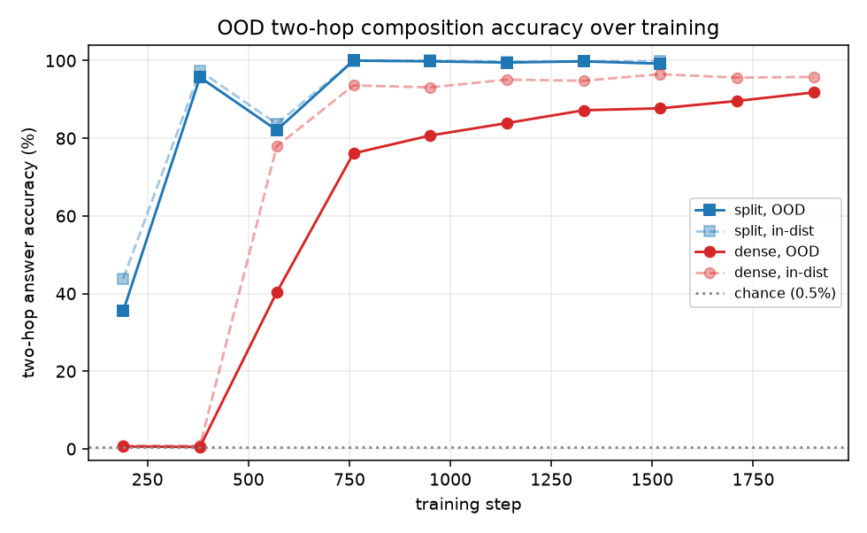
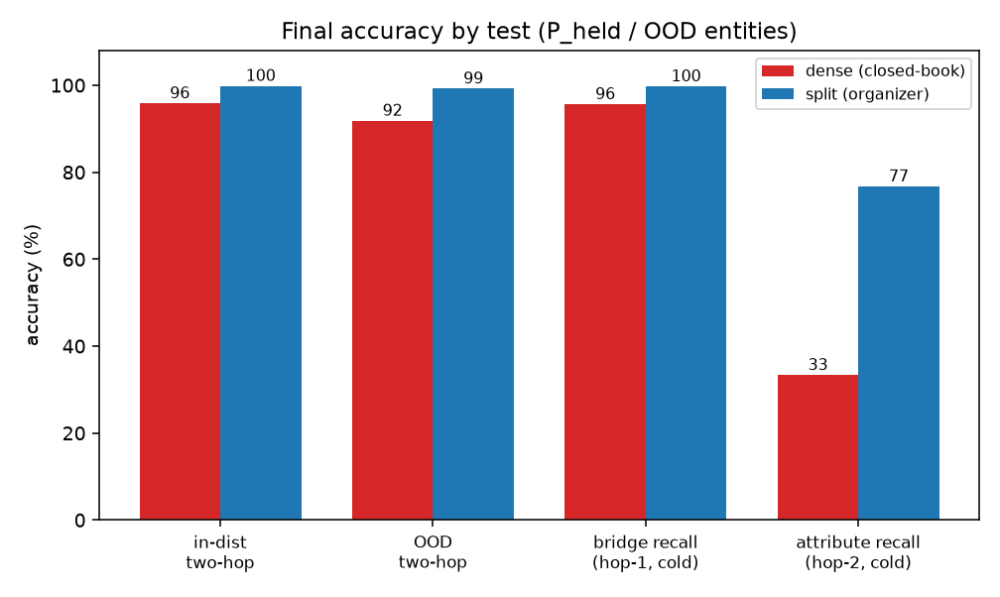

# Two-fact composition: dense vs split (2026-07-22)

First run of the composition endpoint that replaces the stalled reasoning tasks
(mod-23 iGSM sat at chance; deduction showed no arm difference). It tests the one
case where an external lookup is expected to help: out-of-distribution two-hop
composition. Result in one line: the task is learnable, but the dense baseline
already generalizes to held-out entities (91.8%), so at this fact load there is no
room for the split model to win. Both arms are single-seed, so the 99.2 vs 91.8
gap is not yet attributable to the architecture.

## Setup

Two 160M models (`d160m`: 12 layers, 768 dim), identical in every way except how
fact *values* are handled during training.

- **Dense**: every token is graded, so facts must be stored in the weights.
  Answered closed-book at eval.
- **Split**: each fact value is wrapped in a lookup and loss-masked, so the model
  is only trained to ask for the value, not to produce it. An external
  `(entity, relation) -> value` table supplies it at eval.

The task is a two-hop question over made-up people, for example *"What is the
employer of Kai Nakamura's mentor?"*. Hop 1 maps the person to a bridge person
(their mentor); hop 2 maps the bridge person to the queried attribute. The bridge
person is never named in the question.

Training document for that question, in each arm (`⟦ ⟧` = loss-masked):

```
dense:  Reasoning: Kai Nakamura's mentor is Lena Ortiz. Their employer is
        Delphi Systems. So the answer is Delphi Systems. Answer: Delphi Systems

split:  Reasoning: Kai Nakamura's mentor is <|db_start|>Kai Nakamura, mentor
        <|db_retrieve|>⟦ Lena Ortiz⟧<|db_end|>. Their employer is
        <|db_start|>Lena Ortiz, employer<|db_retrieve|>⟦ Delphi Systems⟧<|db_end|>.
        So the answer is Delphi Systems. Answer: Delphi Systems
```

The hop-2 query contains the bridge name, which in the split arm only ever appears
as hop 1's masked return value. The split model therefore has to copy hop 1's
retrieved value into hop 2's query. That copy is the capability being tested.

## Corpus

10,000 synthetic people, each with 6 biographical attributes (birth city,
university, major, employer, etc.) and 2 functional bridge relations (`mentor`,
`advisor`) pointing to exactly one other person. 600M tokens per arm, mixed as:

| component | share | content |
|---|---:|---|
| bio | 20% | atomic attribute facts, ~20 paraphrase templates each (single-hop) |
| bridge | 13% | atomic bridge facts, e.g. "X's mentor is Y" (single-hop) |
| compose | 67% | two-hop reasoning documents (the skill) |

People are split into two disjoint groups with bridge edges closed inside each
group:

- **P_comp** (8,000): appear in two-hop training documents.
- **P_held** (2,000): appear only as atomic single-hop facts, never composed. This
  is the OOD test set.

Exposure counts: 160 per attribute, 105 per training composition triple (64,000
triples). Dense trained 1.0B tokens (finished, final loss 0.096); split trained
~0.87B before the Colab session ended (final loss 0.066, already saturated by
~370M tokens). Throughput ~185k tokens/s on one A100.

## Evals and method

Three held-out sets, all scored by exact match on the text after `Answer:`:

1. **In-distribution** two-hop over P_comp (held-out attribute combinations the
   specific triple was never trained on). Interpolation control.
2. **OOD** two-hop over P_held. The real test.
3. **Single-hop probes** for both hops, used to check fact access.

For the split arm we also parse the two lookup queries it emits and check each key
exactly, which shows whether it addressed hop 1 and copied the bridge into hop 2
correctly. Two lookups at accuracy p give about p² end to end, so this localizes
any failure to retrieval rather than reasoning.

One correction: the first Colab run scored the single-hop probes with the
`Answer:` parser, but those probes end mid-sentence, so they read ~0 and produced a
spurious "weak fact access" verdict. Fixed, and the numbers below are re-scored on
the same checkpoints (`compose_eval/recheck_factaccess.json`). Two-hop scores were
never affected.

## Results

Chance is ~0.5% (exact match against a large value pool).



Dense learns the task through a sharp transition between steps 380 and 570 (0.8% to
78% in-distribution), then its OOD accuracy climbs steadily to 91.8%. Split reaches
near-ceiling much earlier.



| metric (P_held / OOD) | dense | split |
|---|---:|---:|
| in-distribution two-hop | 95.8% | 99.8% |
| **OOD two-hop** | **91.8%** | **99.2%** |
| bridge recall (hop-1, cold probe) | 95.6% | 99.7% |
| attribute recall (hop-2, cold probe) | 33.3% | 76.7% |
| OOD per-hop lookup keys, both correct | n/a | 99.3% |

One number needs care. The composed OOD accuracy is higher than the product of the
two cold single-hop accuracies (dense: 0.96 × 0.33 ≈ 0.31, but 0.92 observed). For
the split arm we can check the reasoning trace directly: it writes the correct hop-1
key and copies the bridge into a correct hop-2 key on 99.3% of OOD items, so its
composition is genuine and the cold probe simply understates recall inside the
reasoning context. Dense leaves no such trace, so we cannot yet rule out that its
92% partly reflects a shortcut rather than true chaining.

## Conclusions

1. The composition task clears chance and is learnable, so it is a usable endpoint
   (unlike the earlier iGSM/deduction tasks). This was the main goal of the run.
2. The dense baseline generalizes to never-composed entities on its own (91.8%). At
   this fact load the memory-split gives no clear advantage, which matches the null
   direction from LMLM and the earlier deduction result.
3. The split arm composes correctly through verified lookups. Its edge over dense
   (99.2 vs 91.8) is real in this run but rests on one seed per arm, so it is within
   plausible seed variation and cannot be credited to the architecture yet.

Caveats: single seed per arm; split training stopped early (though saturated);
the cold single-hop probe understates in-context recall; and 160 exposures per
attribute makes the single facts easy to memorize, which is likely why dense
generalizes at all.

Next steps, in order:

1. Corrupt hop 1's output mid-generation for the dense arm and confirm the answer
   collapses. This checks whether dense's 92% is genuine two-hop or a shortcut.
2. Add seeds so the arm gap gets an error bar.
3. Add a dense open-book arm (dense given the same table at eval) to separate a
   learned procedure from simply having the facts available.
4. Raise the fact load until dense's single-hop recall drops. That regime, where
   the facts no longer fit comfortably in the weights, is where the organizer is
   expected to matter.
