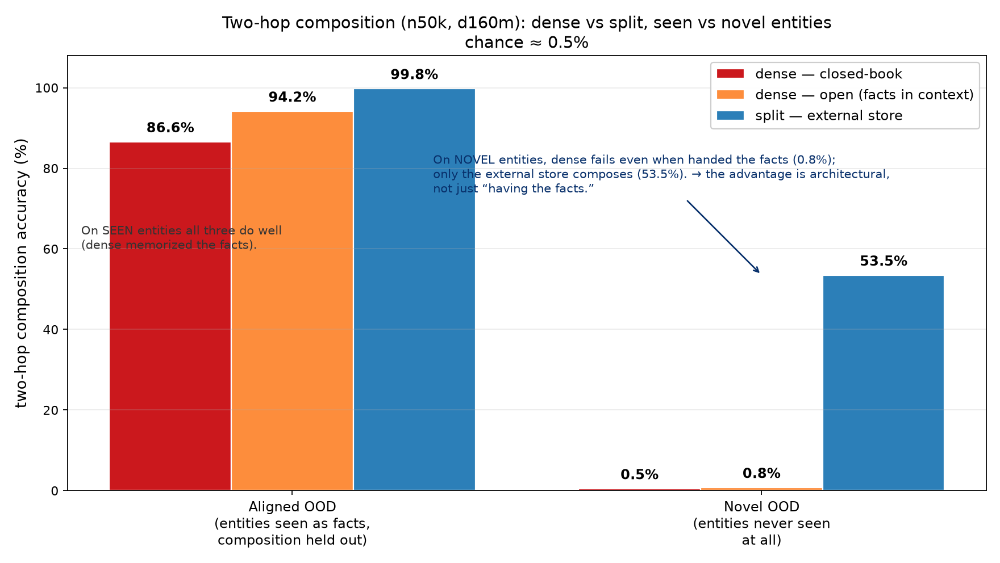
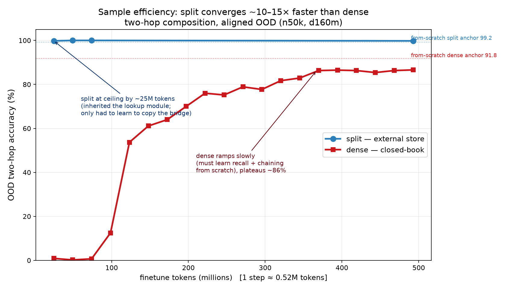

# Compose finetune — dense vs split (base n50k)

**Setup:** `d160m` (162M), finetuned from the seed-0 `n50k` bases on two-hop composition
(10k entities, seed 1234). Eval = repo's `run_compose_eval.py` on held-out sets; **split
store ON, dense closed-book**. Chance ≈ 0.5%. Local dense-OPEN control via
`dense_open_eval.py`.

## Headline

| two-hop OOD accuracy | Aligned OOD *(entities seen as facts; composition held out)* | Novel OOD *(entities never seen)* |
|---|:--:|:--:|
| dense — closed-book | 86.6% | 0.5% |
| dense — open (facts in context) | 94.2% | 0.8% |
| **split — external store** | **99.8%** | **53.5%** |

**One line:** on *seen* entities all three compose (dense has the facts memorized); on
*novel* entities **dense fails even when handed the facts (0.8%)** while **only the store
composes (53.5%)** — so split's novel advantage is **architectural, not just "having the
facts."**

## Sample efficiency

Split is at ceiling by **~25M tokens**; dense turns on only at **~100M** and plateaus
**~86% by ~370M** — split is **~10–15× more sample-efficient**. *Caveat:* this conflates
"the lookup format is more learnable" with **split's head start** (its base already had the
lookup module; the finetune only had to learn "copy the bridge"). Isolating the format's
own contribution needs a **from-scratch** convergence comparison (we only have the
from-scratch *final* anchors: split 99.2 / dense 91.8).

## Reading the evals — aligned vs novel
Both corpora are the same generator with a different **seed**:
- **Aligned** (seed 1234): prefix-stable → the **first 10k of the base's own training
  people** → the base **already memorized their facts**.
- **Novel** (seed 1234+777): **entirely different people**, never seen; **eval-only**.

Within each, **P_held (OOD) is held out from the *composition* docs** (people seen only as
atomic facts). So **aligned OOD** = "apply the 2-hop procedure to new fact-combos of
*known* people"; **novel OOD** = "compose facts about people *never seen*." Framing: dense
= **closed-book exam**; split = **open-book with an updatable notes app**. Novel OOD is the
cleanest test of the memory-split thesis (parametric memory is frozen at training time;
aligned hides this because dense's memorization masks it).

## Findings

**1. On seen entities, both compose; split's edge is fact-access, not chaining.**
Dense OOD 86.6% but **88.8% conditioned on accessing both facts** (access rate only 80.3%,
cold hop-2 87.4%). So dense composes fine *when it recalls the facts*; the gap to split
(99.8%) is dense's ~87% lossy memory vs the store's ~100% exact recall.

**2. Novel entities — the fairness control flips the conclusion.** We gave dense the same
facts (RAG-style in-context KB: the 2 needed facts + 8 distractors), and:
- aligned: **86.6 → 94.2%** (dense *does* use an in-context KB — not format-blind),
- novel: **0.5 → 0.8%** (unchanged). The only variable between these is **entity
  familiarity**, so the novel failure is **entity-novelty, not format**: dense **cannot
  compose over entities it has never seen even with the facts in front of it.**
So split's novel win is architectural: the lookup interface turns **soft in-context binding
of novel entities (which dense can't do)** into **copy-the-name + exact symbolic store
lookup**. Dense is *doubly* stuck on novel (no stored fact **and** can't bind in-context).

**3. Split's novel ceiling (53.5%) is *addressing*, not the store.** Split emits **both
correct lookup keys only 26%** of the time on novel names (single-hop key emission 38–60%);
**when it addresses correctly it composes at 83.7%.** So the residual limit is
**name-copy / key-generation to unseen names** (matches the earlier `keyguess` probe: OOD
key ~43%, name-copy ~54%) — an **improvable** limit (entity diversity / copy training),
unlike dense's fundamental one. *(Correction: the split base's earlier "100% single-hop on
new entities" was on seed-1234 people — the base's own, i.e. familiar, not novel.)*

**4. No catastrophic forgetting in dense — but for a mundane reason.** Held single-hop
87–92% (≥ base 79%), and it *learned the bridges* (absent in base). The compose corpus
**re-includes bio (20%) + bridge (13%) facts**, so dense keeps memorizing them. The
"in-weight finetuning erodes knowledge" prediction (In-Tool Fig 5) is **dodged because the
finetune data isn't pure composition** — it would likely bite on a composition-only run.

## Interpretation (H1 at n50k)
At this fact load **both arms learn composition** (no dramatic aligned-OOD gap — expected,
since 50k entities create no memory pressure). The split advantages that appear are
**sample-efficiency** and **novel-entity generalization**. The **decisive accuracy
separation is predicted at n800k**, where dense's memory (and its ~80% access) should
crater while the store stays exact. Ties to literature ([`RELATED-WORK.md`](RELATED-WORK.md)):
faster in-tool convergence + OOD-generalizing rule replicate *In-Tool Learning*
(2508.20755); dense composing only when it can recall matches *Physics 3.2*; neither arm
generalized by **depth** (split 3-hop = 0%) — consistent with grokking-composition not
being systematic.

## Caveats
- **n50k, single seed** → directions, not proofs; n50k is the positive-control regime, not
  the decisive one.
- **dense-OPEN format shift:** dense was trained closed-book, so in-context multi-hop is
  mildly OOD — but the 94.2% aligned run shows it *uses* the KB, so the novel collapse is
  genuinely entity-novelty.
- **Eval-verdict banners:** the script's dense-**novel** "KILL/FIX (mis-scaled)" is a
  misfire (novel corpus is entirely unseen → closed-book dense floors on all of it); the
  split-**novel** "INCONCLUSIVE — fact-access confound" is correct.

## Open / next
- **n800k pair** — the fact-load regime that actually tests the thesis (dense memory
  collapses; aligned gap should open).
- **Dense trained with in-context KBs**, then re-run dense-OPEN novel — settles the one
  dense-OPEN caveat (is novel failure fundamental or closed-book-training artifact?).
- **From-scratch convergence** dense vs split — isolates "format more learnable" from
  split's head start.
- **Mixed-depth (2+3-hop) finetune → test 4-hop** — recursion/systematicity (both arms).

## Provenance
Split `split_n50k_ft` (store on) / dense `dense_n50k_ft` (closed-book), step 940, via the
repo's `run_compose_eval.py` on `data/compose_v1` (+ `compose_novel`). Dense-OPEN via
`dense_open_eval.py` (RAG KB, 8 distractors). Figures: `make_comparison_fig.py`,
`make_sweep_fig.py`. Raw JSON in each run's `eval_aligned/` + `local_eval_*.json`.
